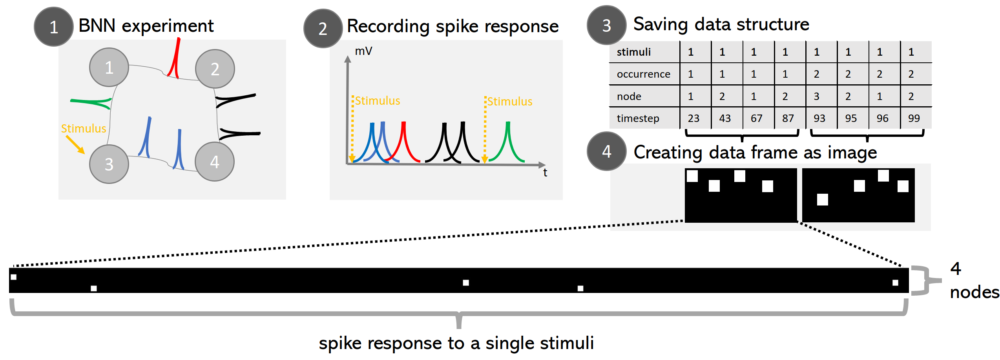
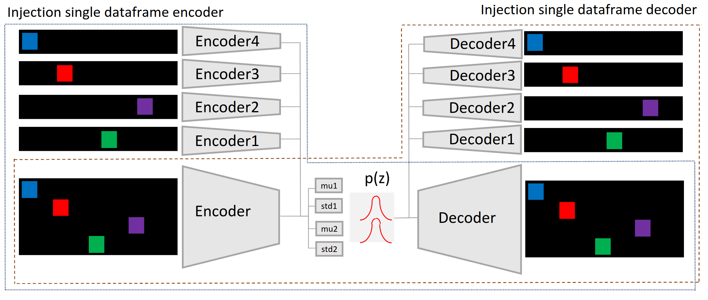

## Beta-Variational Autoencoder (Beta-VAE) for Biological Neural Network responses 
#### HS2021 Semester project at the Laboratory of Biosignals and Bioelectronics ETH Zurich

### Goal of project

The project is focused on the data analysis of spike responses of BNNs using a Beta-VAE. The goal of the
project is to find a highly disentangled latent representation of single stimulation
induced spike responses. The encoder of the VAE can be further used for a Reinforcement Learning task 
in Biological Neural Networks.

### Dataset

The data set for the Beta-Variational Autoencoder is prepared as outlined in the image below.  Step 1) 4-node BNN experiment where 125 stimuli are applied, Step 2) Recording the spike responses on each of the 4 nodes with a multi-electrode array, 
each color (blue, red, black and green) reflects the node at which spike was recorded, Step 3) Saving spike recording into a data array: Each column corresponds to one spike response, Step 4) Creating dataframe as image: The spike responses belonging to a single occurrence of a 
particular stimulus are saved as an 8-bit image. The dataset from recorded from the BNN is
available on request from zaluskat@ethz.ch.



### Architecture

The Beta-VAE is based on a Resnet18 model, with one Resnet18 for 4 concatenated single spike responses and 4 Resnet18s for each individual spike responses in parallel as depicted below.



### Required python packages
```
pip install -r requirements.txt 
```

### Training
Training requires to run train.py. Standard settings can be changed in vae/utils.parser.

### Inference
Inference is done calling inference.py. It loads the trained model saved in /trained_model. An example of a spike response is provided in /example.